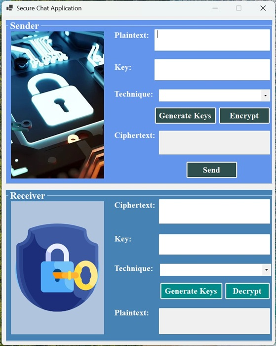

# Secure Chat Application

### 📌 Project Overview
The **Secure Chat Application** is a Windows-based application developed in **Visual Studio** using **VB.NET**.  
It allows users to exchange messages securely using both **symmetric** and **asymmetric** cryptographic techniques.  
The project implements multiple algorithms for encryption, decryption, integrity checking, and authentication.

---

### 🛠 Technology Stack
- **IDE:** Visual Studio  
- **Language:** VB.NET  
- **Framework:** .NET Framework / Windows Forms  
- **Crypto Algorithms:** Symmetric, Asymmetric, Hashing, and Digital Signature

---

### 🔐 Supported Cryptographic Techniques

### Symmetric Encryption
- Caesar Cipher  
- Monoalphabetic Cipher  
- Polyalphabetic Cipher  
- Hill Cipher  
- Playfair Cipher  
- One-Time Pad (OTP)  
- Rail Fence Cipher  
- Columnar Cipher  
- DES (Data Encryption Standard)  
- AES (Advanced Encryption Standard)  
- RC4 Stream Cipher  

### Asymmetric Encryption
- RSA  
- ECC (Elliptic Curve Cryptography)  

### Key Exchange
- Diffie-Hellman (DH)  

### Integrity & Authentication
- SHA Hashing (Message Integrity)  
- DSA (Digital Signature Algorithm)  

---

### 💡 How It Works

1. **Key Exchange**  
   - Symmetric: Pre-shared key between sender & receiver  
   - Asymmetric: Public/Private key pairs for secure message exchange  

2. **Encryption**  
   - Sender selects technique, inputs plaintext, and applies encryption with the chosen key  

3. **Transmission**  
   - Encrypted message (ciphertext) is sent to receiver  

4. **Decryption**  
   - Receiver uses correct key/technique to decrypt back to plaintext  

5. **Integrity & Authentication**  
   - SHA hashing ensures data integrity  
   - DSA verifies sender authenticity  

---

### 📸 Screenshots

**Main Interface**  

**Encryption Example**  

**Decryption Example**  

---

This project reinforced the following cybersecurity skills:

### 🔑 Cryptography Fundamentals
- Implemented **symmetric encryption** (AES, DES, RC4, OTP) and **asymmetric encryption** (RSA, ECC).
- Applied **classical ciphers** (Caesar, Playfair, Rail Fence, Columnar) for foundational understanding.
- Used **hashing algorithms** (SHA) for message integrity.
- Integrated **digital signatures** (DSA) for authentication and non-repudiation.
- Applied **key exchange protocols** (Diffie-Hellman) to establish secure communication channels.

### 💻 Secure Software Development
- Built a security-focused application in **VB.NET** with **Windows Forms GUI**.
- Designed secure handling of keys, plaintext, and ciphertext in memory.
- Implemented input validation to prevent malformed data and injection attacks.
- Balanced **usability** with strong security measures.

### 🔄 Secure Communication Protocol Design
- Designed message flows ensuring **confidentiality, integrity, and authenticity**.
- Implemented encryption before transmission and verification upon receipt.
- Demonstrated understanding of secure key sharing in different encryption models.

### 🛠 Key Management & Distribution
- Used **pre-shared keys** in symmetric encryption scenarios.
- Managed **public/private key pairs** for asymmetric encryption.
- Simulated **secure key exchange** with Diffie-Hellman.

### 📊 Security Testing & Validation
- Verified correct encryption and decryption processes.
- Tested hashing outputs to confirm integrity.
- Conducted functional tests to ensure only authorized decryption succeeds.

### 🧠 Problem-Solving & Algorithm Selection
- Compared strengths and weaknesses of multiple encryption methods.
- Distinguished between **outdated** algorithms and **modern industry standards**.
- Made informed choices about algorithm suitability for different use cases.

[← Back](https://github.com/mmransem09/mmransem09/blob/main/README.md)
